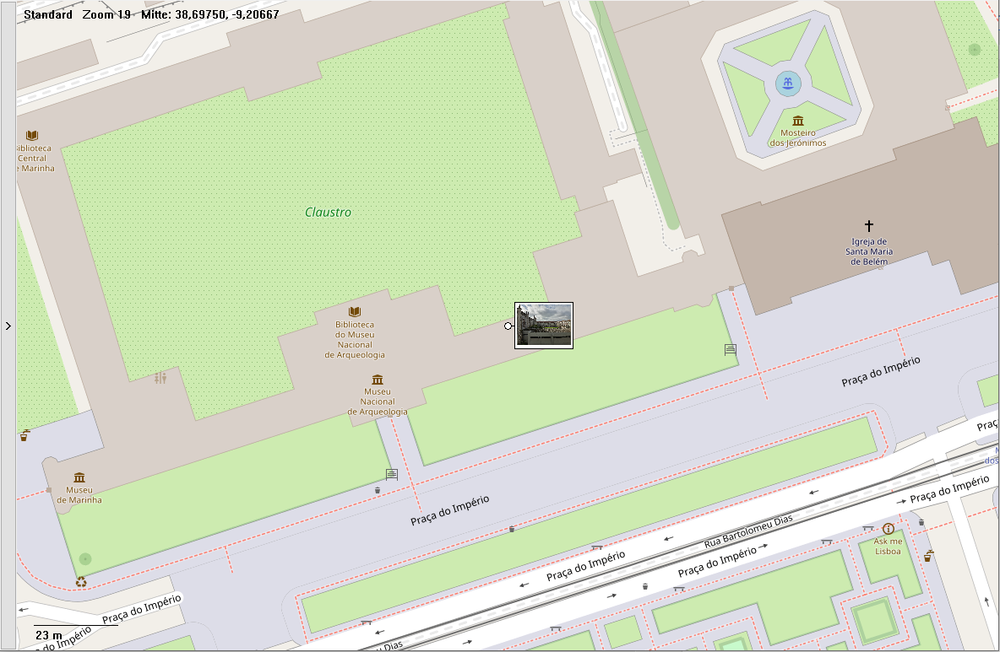
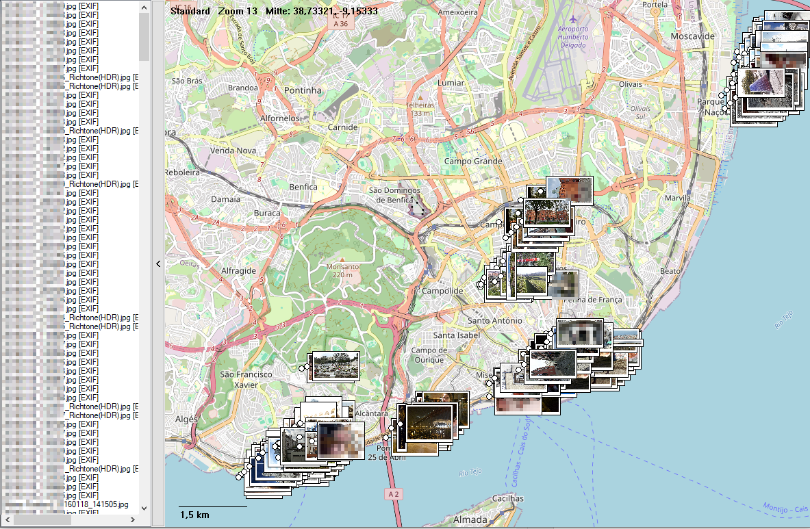

# GeoPhotoLister




GeoPhotoLister is a 32-bit and 64-bit Total Commander WLX Lister plugin for
displaying geotagged JPEG photos on an interactive map.

Each positioned photo is shown at its GPS location with an optional thumbnail
and filename. Photos without usable coordinates remain available in the
collapsible photo list.

## Features

- Displays `.jpg`, `.jpeg`, and `.jpe` files on a Web Mercator map
- Reads GPS coordinates from EXIF, embedded XMP, and XMP sidecar files
- Supports decimal coordinates and degree/minute/second XMP coordinates
- Reads coordinates in parallel and displays the map extent before thumbnails are generated
- Generates thumbnails in parallel and adds them progressively to the map
- Prefers sufficiently large embedded EXIF thumbnails for faster preview generation
- Shows aspect-ratio-preserving JPEG thumbnails at their map positions
- Shows filenames without extensions on the map
- Shows the full filename as a tooltip when map filenames are disabled
- Lists the metadata source used for each positioned photo
- Optionally lists photos without coordinates as `[No Position]`
- Loads individual JPEGs, directories, and generated `.geophotolist` manifests
- Loads all JPEGs from the current photo directory with the `D` key
- Provides standard, satellite, and topographic tile maps
- Keeps downloaded map tiles in a persistent, size-limited offline cache
- Prefetches configurable tile rings around the visible map area
- Supports panning, zooming, fit-to-window, map-style switching, and tile toggle
- Includes a collapsible, vertically and horizontally scrollable photo list
- Shows a bottom status bar with the main keyboard shortcuts
- Centers the selected photo preview without changing the current zoom
- Includes a launcher for displaying multiple files selected in Total Commander

Directory loading is non-recursive. Only JPEG files directly inside the
directory are included.

## Installation

Install `GeoPhotoLister.wlx` as a Lister plugin in Total Commander:

1. Open **Configuration > Options > Plugins > Lister plugins (WLX)**.
2. Add `GeoPhotoLister.wlx` from the `dist` directory.
3. Keep `GeoPhotoLister.wlx64`, `GeoPhotoLister.ini`, and the other distributed
   files in the same plugin directory.

Total Commander automatically uses `GeoPhotoLister.wlx64` in its 64-bit
edition.

The plugin can also be installed by opening a packaged plugin archive containing
`pluginst.inf` in Total Commander.

## Opening Photos

### Single JPEG

Press `F3` on a JPEG containing EXIF or XMP GPS metadata.

### Directory

Open a directory through the plugin to display all JPEG files directly inside
that directory. Subdirectories are not scanned.

### Multiple Selected Files

Create a Total Commander toolbar button:

```text
Command:    <plugin directory>\GeoPhotoListerLauncher.exe
Parameters: %Y %WL "/fallback=%P."
```

The launcher converts Total Commander's selected-file list into a temporary
`.geophotolist` manifest and opens it in Lister. Selected directories contribute
their directly contained JPEG files.

The launcher also accepts JPEG files and directories directly, including
multiple command-line arguments. It is built as a Windows GUI application and
does not open a console window.

When Total Commander's `..` entry is selected, `%WL` is empty. Without `%Y`,
Total Commander suppresses the entire parameter line when a list parameter is
empty. `%Y` forces Total Commander to pass the empty list and the remaining
arguments. `"/fallback=%P."` supplies the current panel directory in that case.
The fallback is ignored when `%WL` contains selected files or directories.

`GeoPhotoListerLauncher.exe` is the 64-bit launcher.
`GeoPhotoListerLauncher32.exe` is also included for 32-bit environments.

### Manifest Format

A `.geophotolist` file is a UTF-8 text file containing one JPEG or directory
path per line. A generated manifest starts with:

```text
GEOPHOTOLIST/1;SOURCE=FILE
C:\Photos\photo1.jpg
C:\Photos\photo2.jpg
C:\MorePhotos
```

Blank lines are ignored. Directories are scanned non-recursively.
Launcher-generated manifests use `SOURCE=FOLDER` when they contain exactly one
directory. This allows `NoSidebarForFolder` and `NoSidebarForFile` to be applied
correctly even though Total Commander opens a temporary manifest file.

## Controls

| Input | Action |
| --- | --- |
| Mouse wheel | Zoom in or out and center the map on the mouse position |
| Drag map | Pan |
| Arrow keys | Pan |
| Escape | Close the Lister, including when the photo list has focus |
| Click photo-list entry | Center its preview at the current zoom |
| Double-click photo-list entry | Open the original JPEG, if enabled |
| Double-click map preview | Open the original JPEG, if enabled |
| Sidebar arrow | Collapse or expand the photo list |
| `D` | Load all JPEG files from the current photo's directory and apply `NoSidebarForFolder` |
| `F` | Fit all positioned photos into the map |
| `T` | Cycle standard, satellite, and topographic maps |
| `M` | Toggle map tiles |
| `1` through `8` | Forward the key to Total Commander |

The bottom status bar shows the primary `D`, `F`, `T`, `M`, and `Escape`
shortcuts.

## Location Metadata

GeoPhotoLister always attempts to read EXIF GPS metadata. Embedded and sidecar
XMP reading can be enabled or disabled independently.

When several coordinate sources exist, the effective priority is:

1. XMP sidecar
2. Embedded XMP
3. EXIF GPS

Later sources in the reading process replace earlier coordinates. The selected
source is displayed in the photo list as `EXIF`, `XMP`, or `XMP-Sidecar`.

An XMP sidecar must have the same base name as the JPEG:

```text
photo.jpg
photo.xmp
```

The XMP parser reads `exif:GPSLatitude` and `exif:GPSLongitude`. Supported
examples include:

```text
52.520000
13,405000
52,31.2N
13,24.3E
52 deg 31 min 12 sec N
```

## Configuration

GeoPhotoLister reads `[GeoPhotoLister]` from `GeoPhotoLister.ini` located beside
the active WLX file. Restart or reopen the Lister view after changing options.

Boolean values accept `1`, `true`, or `yes` as enabled values. Other values are
treated as disabled.

### Map And Viewer Options

| Option | Default | Description |
| --- | ---: | --- |
| `useTiles` | `1` | Enables downloaded map tiles. Can be toggled temporarily with `M`. |
| `requestDelayMs` | `75` | Minimum delay in milliseconds between actual network tile requests, clamped to `0` through `10000`. It also controls the tile-processing timer between `15` and `200` milliseconds. All available cached tiles for the current area are loaded together without this delay. |
| `prefetchRings` | `2` | Number of additional tile rings downloaded around the visible map area, clamped to `0` through `8`. |
| `maxBitmaps` | `512` | Maximum number of offline tile files stored in `%TEMP%\GeoPhotoLister`, clamped to `64` through `4096`. The oldest files are deleted first. This value also limits the in-memory tile count. |
| `showScale` | `1` | Shows the approximate scale at the bottom of the map. |
| `showCoords` | `1` | Shows map style, zoom level, and center coordinates. |
| `initialZoom` | `13` | Initial/fallback zoom, clamped to `3` through `19`. Fit-to-window normally selects the displayed zoom. |

### Photo Display Options

| Option | Default | Description |
| --- | ---: | --- |
| `thumbnailSize` | `64` | Maximum thumbnail width or height in pixels. The value is clamped to `24` through `256`; aspect ratio is preserved. |
| `useExifThumbnails` | `1` | Prefers an embedded EXIF JPEG thumbnail when its longest edge is at least `thumbnailSize`; otherwise the full JPEG is decoded. |
| `workers` | `4` | Number of parallel workers used to read EXIF and XMP metadata, clamped to `1` through `32`. |
| `thumbnailWorkers` | `2` | Number of parallel workers used to create thumbnails after the map extent is available, clamped to `1` through `16`. |
| `showFileNames` | `1` | Shows the filename without extension beside each map thumbnail. With `0`, the white marker contains only the preview and the full filename appears as a hover tooltip. |
| `showThumbnails` | `1` | Shows JPEG previews. With `0`, compact placeholder markers are used. |
| `showUntaggedPhotos` | `1` | Shows photos without coordinates in the sidebar under `No Position`. With `0`, they are hidden from the sidebar. |
| `labelCollisionAvoidance` | `1` | Moves overlapping previews by at most 80 pixels horizontally and 50 pixels vertically. If no free position exists within that range, the preview remains at its original position. The selected preview is placed first. |
| `openOnDoubleClick` | `1` | Opens the original JPEG using its Windows file association when a list entry or map preview is double-clicked. |
| `sidebarWidth` | `220` | Initial expanded photo-list width, clamped to `120` through `600` pixels. |
| `NoSidebarForFile` | `0` | Starts with the sidebar collapsed when the Lister receives a file. |
| `NoSidebarForFolder` | `0` | Starts with the sidebar collapsed when the Lister receives a folder. |

### Metadata Options

| Option | Default | Description |
| --- | ---: | --- |
| `readEmbeddedXmp` | `1` | Reads XMP contained in JPEG APP1 segments. |
| `readSidecarXmp` | `1` | Reads a same-name `.xmp` sidecar file. |

EXIF GPS reading is always enabled.

### Tile And Network Options

Tile endpoint templates must contain `{z}`, `{x}`, and `{y}` placeholders.

| Option | Default | Description |
| --- | --- | --- |
| `standardTileEndpoint` | OpenStreetMap | URL template for the standard map. |
| `satelliteTileEndpoint` | Google satellite tiles | URL template for the satellite map. |
| `topoTileEndpoint` | OpenTopoMap | URL template for the topographic map. |
| `userAgent` | `GeoPhotoLister` | HTTP user-agent sent when downloading tiles. |

### Tile Cache And Prefetching

Downloaded map tiles are stored in `%TEMP%\GeoPhotoLister` and remain available
across Lister and Total Commander sessions. The exact location is the temporary
directory of the Windows user running Total Commander.

Cache filenames contain the configured endpoint, map style, zoom, and tile
coordinates. Tiles from different configured endpoints and map styles can
therefore coexist. Changing an endpoint causes GeoPhotoLister to use a separate
set of cache files.

When displaying a map area, GeoPhotoLister first loads all matching cached
tiles and may request one missing tile during the same processing cycle.
`requestDelayMs` applies only between network requests; it does not delay
reading cached files. The processing timer runs every
`Max(15, Min(200, requestDelayMs))` milliseconds. Waiting for the next allowed
network request does not block the Lister user interface.

`prefetchRings` extends loading and downloading beyond the currently visible
area. A value of `0` processes only visible tiles. Higher values make nearby
panning more likely to use cached tiles, but increase network traffic and cache
usage.

`maxBitmaps` limits both the number of `.tile` files in the persistent cache and
the number of tiles held in memory. The limit applies across all endpoints,
styles, and zoom levels. When the disk limit is exceeded, the oldest downloaded
cache files are deleted first. Invalid cached files are removed automatically
when they cannot be decoded.

The cache can be cleared manually by deleting `%TEMP%\GeoPhotoLister` while no
GeoPhotoLister view is open. The directory is recreated automatically.

Example:

```ini
[GeoPhotoLister]
useTiles=1
requestDelayMs=75
prefetchRings=2
maxBitmaps=512
showScale=1
showCoords=1
initialZoom=13

thumbnailSize=64
useExifThumbnails=1
workers=4
thumbnailWorkers=2
showFileNames=1
showThumbnails=1
showUntaggedPhotos=1
labelCollisionAvoidance=1
openOnDoubleClick=1
sidebarWidth=220
NoSidebarForFile=0
NoSidebarForFolder=0

readEmbeddedXmp=1
readSidecarXmp=1

standardTileEndpoint=https://tile.openstreetmap.org/{z}/{x}/{y}.png
satelliteTileEndpoint=https://mt1.google.com/vt/lyrs=s&x={x}&y={y}&z={z}
topoTileEndpoint=https://a.tile.opentopomap.org/{z}/{x}/{y}.png
userAgent=GeoPhotoLister
```

The configured tile services may have their own usage policies, attribution
requirements, availability limits, or access restrictions. Configure suitable
endpoints for your use case.

### Currently Ignored Compatibility Options

The distributed INI retains several keys inherited from the original GPX
Lister configuration. They are currently not evaluated by GeoPhotoLister:

```text
showGridWhenNoTiles
metadataPriority
mapTypeOrder
tileEndpoint
backoffStartMs
backoffMaxMs
```

## Building

The repository contains Lazarus project files for the plugin and launcher:

```text
GeoPhotoLister.lpi
GeoPhotoListerLauncher.lpi
```

The projects provide `Win64 Release` and `Win32 Release` modes. The Win32 mode
uses the installed FPC cross compiler.

Build and package both architectures with:

```powershell
powershell -ExecutionPolicy Bypass -File .\build.ps1
```

The packaged files are written to `dist`.
